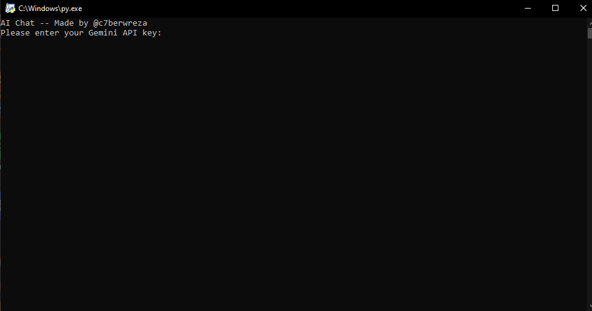
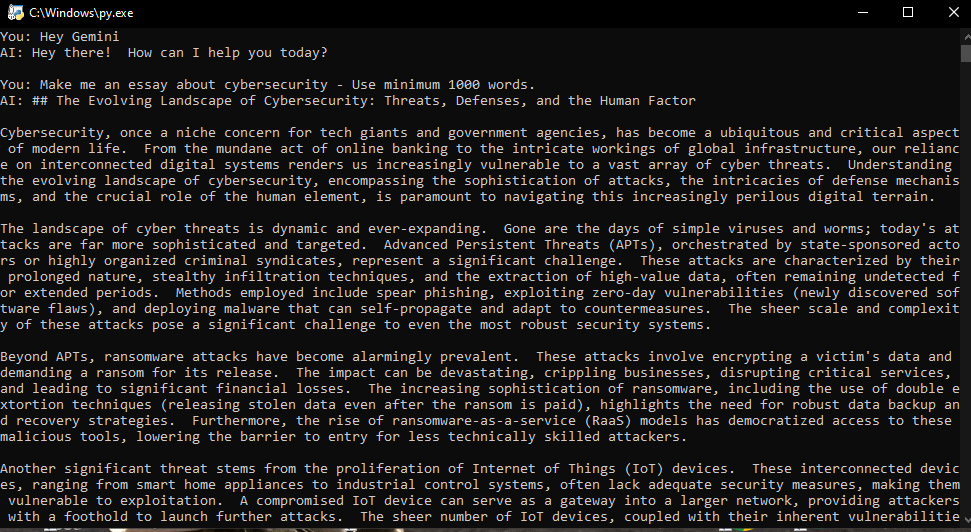

# Gemini AI Chat with Python

A Python script that interacts with the Gemini API (1.5) to generate AI-powered responses.

## Features
- Interactive AI chat interface
- Gemini API integration


)
) 


## Requirements
- Python 3.7 or higher
- An API key for the Gemini API 

## Setup Instructions

1. **Clone the Repository**:
   ```bash
   git clone https://github.com/cyberwreza/Gemini-AI-Chat


2. **Open the script**:
   ```bash
   python GeminiAI.py

3. **Paste your Gemini API**


***Contact me in Discord if you have any issues. - 0p98***


